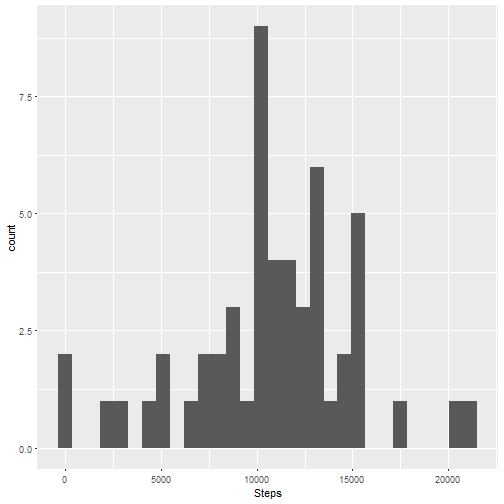
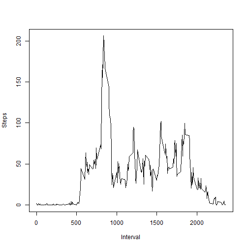

## Introduction

It is now possible to collect a large amount of data about personal movement using activity monitoring devices such as a Fitbit, Nike Fuelband, or Jawbone Up. These type of devices are part of the "quantified self" movement - a group of enthusiasts who take measurements about themselves regularly to improve their health, to find patterns in their behavior, or because they are tech geeks. But these data remain under-utilized both because the raw data are hard to obtain and there is a lack of statistical methods and software for processing and interpreting the data.

This project use data from those devices collected during two months in October and November 2012 and try to answer multiple questions we can ask ourselves based on this data.

## Loading and preprocessing the data

This is the first step of this project and it's, of course, mandatory. For this, we just use the *read.csv()* method and then we convert the "date" column into real dates so it can be used later.


```r
activity <- read.csv("activity.csv")

activity$date = as.Date(activity$date, "%Y-%m-%d") 
```

## What is mean total number of steps taken per day?

This is the first question that we're going to answer.

First of all, we'll try to get the total of steps taken per day with the *aggregate()* function and we give more descriptive names to the columns of the dataframe we just created.


```r
totalstepsbyday <- aggregate(activity$steps ~ activity$date, FUN=sum)

names(totalstepsbyday) = c("date", "steps")
```

We can then create a plot based on this dataframe :


```r
library(ggplot2)
p<-ggplot(data = totalstepsbyday, aes(x=totalstepsbyday$steps)) + 
  geom_histogram() + labs(x = "Steps")
```


For the mean and the median, we use the *mean()* and *median()* functions.

```r
mean(totalstepsbyday$steps)
```

```
## [1] 10766.19
```

```r
median(totalstepsbyday$steps)
```

```
## [1] 10765
```


## What is the average daily activity pattern?

First,  we try to plot the average number of steps per interval. 

```r
activitynona = na.omit(activity)

meanstepsbyinterval <- aggregate(activitynona$steps ~ activitynona$interval, FUN=mean)

names(meanstepsbyinterval) = c("interval", "steps")

plot(meanstepsbyinterval$interval, meanstepsbyinterval$steps, type = "l", xlab="Interval", ylab = "Steps")
```



After that, we try to know what is the interval with the maximum of steps thanks to the function *which.max()*.


```r
meanstepsbyinterval$interval[which.max(meanstepsbyinterval$steps)]
```

```
## [1] 835
```

## Imputing missing values

We then calculate the number of missing values in the dataset :

```r
sum(is.na(activity$steps))
```

```
## [1] 2304
```

We try to fill those NA values with the mean for the 5-min interval that doesn't contain any value. For this task, we'll use a loop and we fill a new dataframe that is a copy of the original dataframe.


```r
activityfillNA = activity

for (i in 1:nrow(activity)){
  if(is.na(activity$steps[i]))
  {
    activityfillNA$steps[i] = meanstepsbyinterval$steps[which(meanstepsbyinterval$interval == activity$interval[i])]
  }
}
```

We create the same plot as before, using the new dataframe we just created this time :


```r
totalstepsbydayfillNA <- aggregate(activityfillNA$steps ~ activityfillNA$date, FUN=sum)

names(totalstepsbydayfillNA) = c("interval", "steps")

p2<-ggplot(data = totalstepsbydayfillNA, aes(x=totalstepsbydayfillNA$steps)) + geom_histogram() + labs(x = "Steps")

plot(p2)
```


And, same as before, we calculate the mean and the median with this dataframe : 


```r
mean(totalstepsbydayfillNA$steps)
```

```
## [1] 10766.19
```

```r
median(totalstepsbydayfillNA$steps)
```

```
## [1] 10766.19
```

We can see that the new median is slighlty higher than the first one, because the value "10766.19" is now present in the values of the data. Therefore, it's pretty logical that the median is equal to the mean.

## Are there differences in activity patterns between weekdays and weekends?

For this question we need to create a new columns that says if the date of the current row is a weekend day or not. We'll use a loop for this.

```r
Sys.setlocale("LC_TIME", "C") # Just to be sure we're using the english language
```

```
## [1] "C"
```

```r
for (i in 1:nrow(activity)){
  if( weekdays(activity[i,2]) %in% c("Saturday", "Sunday") )
  {
    activity$typeday[i] = "weekend"
  }
  else
  {
    activity$typeday[i] = "weekday"
  }
}
```
We can then create the plot that answers the question.


```r
meanstepsbyintervaltypeday <- aggregate(activity$steps ~ activity$interval * activity$typeday , FUN=mean)

names(meanstepsbyintervaltypeday) = c("interval", "typeday", "steps")

library(lattice)

xyplot(meanstepsbyintervaltypeday$steps~meanstepsbyintervaltypeday$interval | factor(meanstepsbyintervaltypeday$typeday), data=meanstepsbyintervaltypeday, pch=19,
       xlab="Interval",  ylab="Number of steps",layout=c(1,2),type=c("l"))
```


